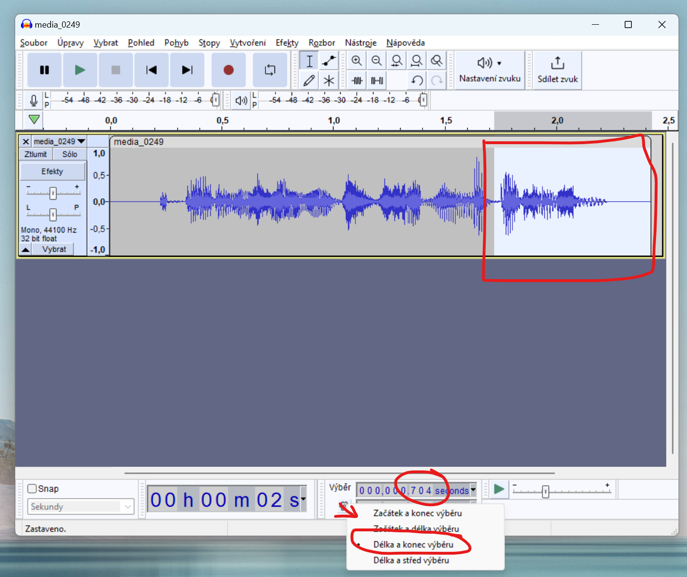

# Albi Tužka (Albi Kouzelné čtení) pro autisty
Tento projekt upravuje zvukové audio knihy pro snadnější použití (nejen) pro autisty.

Projekt vychází z původních [Albi zvukových souborů](https://www.kouzelnecteni.cz/stahnout-audio-soubor/) a potřebuje k přehrávání [Albi tužku + Albi knihu](https://www.kouzelnecteni.cz/)!

## Co se soubory dělám:
1) spojuji základní popis a zvuk 
   - Standardně je zvuk a popis oddělený a musí se mezi nimi přepínat tlačítkem. Tyto soubory mají spojený zvuk + popisek v jednom. Na popisovém tlačítku je tedy `popis + zvuk` a na zvukovém `zvuk + popis`. Např sova bude mít na popisovém tlačítku `sova ... hůůů` a na zvukovém `hůůů ... sova`.
2) Odstraňuji jména zvířátek
   - Nechci aby náš autista říkal "Sovička Evička" když uvidí sovu, ani "Vlk Arnošt", ale jen vlk.  

## Jak to funguje?
- pomocí úžasného nástroje [Albitužka](https://github.com/jindroush/albituzka) od [Táty Geeka](https://tatageek.blog/) dekompiluji původní soubory
- z extrahovaného `bnl.yaml` souboru najdu páry které potřebují spojit (z objektů oid_xXXXX) beru `mode_0` a `mode_4` (nebo dle knihy) a pokud se jejich obsah liší (tj. jeden je popis a druhý zvuk) tak je zařadím do souboru pro spojení.
- Zjistím které soubory je potřeba ořezat o jména postav a pomocí nástroje [Audacity](https://www.audacityteam.org/) zjištuji délku jména v ms a ty od konce ořezávám.

## Co je k tomu potřeba
- [Strawberry Perl](https://strawberryperl.com/) (viz postup od [Táty Geeka - Jak vytvořit vlastní knížku pro Albi tužku](https://tatageek.blog/2022/03/28/jak-vytvorit-vlastni-knizku-pro-albi-tuzku/))
```
perl -MCPAN -eshell;
install MP3::Info
install YAML::Perl
quit
```

- nainstalovat [ffmpeg](https://www.ffmpeg.org/download.html) který se používá pro úpravy zvukových souborů a přidat do PATH ve windows aby šel spouštět pomocí `ffmpeg` z příkazové řádky
- PowerShell (součást všech nových Windows)

## Jak to použít?
- vytvoříte adresář podle názvu knihy (nebo libovolný)
- do něj si stáhnete zvukový soubor z [Albi stránek](https://www.kouzelnecteni.cz/stahnout-audio-soubor/)
- zkopírujete do stejného adresáře [sample.cmd](sample.cmd) soubor a upravíte dle potřeb.
  - `set "book=minikniha-lesni-zviratka"` - název souboru knihy
- spustíte `sample.cmd`
- rozbalí se MP3 soubory a vytvorí yaml soubor (ten bereme jako zdrojový pro zjistění co upravovat)
- přidáte úpravy co se mají dělat se soubory (viz 3 příklady v sample.cmd souboru)
- znovu spustíte `sample.cmd` který již obsahuje úpravy

## Nastavení Audacity
